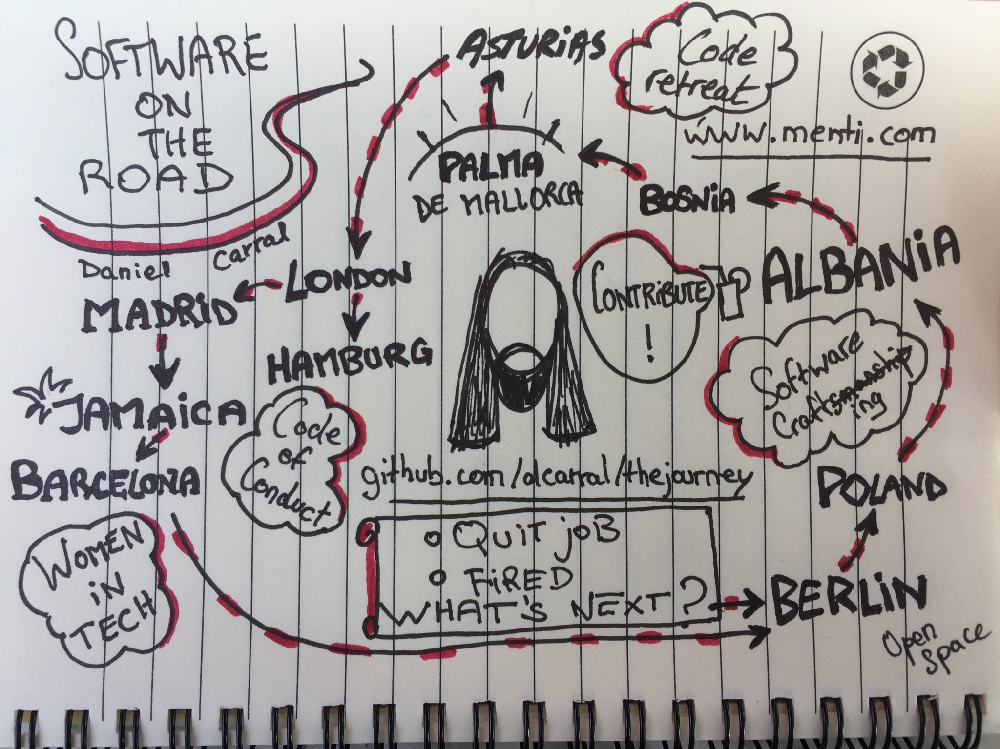

# *“Software on the road: The Journey”*

(Thank you very much to @infosaurus, who created this sketchnote live @ NewCrafts 2018)

Hi, I'm the living repository provided as companion material to the talk *“Software on the road: The Journey”*, so far delivered at:

- *[NewCrafts 2018](https://ncrafts.io/)* @ Paris (May 17th, 2018)
- *[MiXiT 2018](https://mixitconf.org)* @ Lyon (April 19th, 2018)

## Featured activities

* Talk: [What is Software Crafting?](https://github.com/dcarral/software-crafting)
* Coding dojo / workshop: [What is good code? Evaluating code quality](https://github.com/dcarral/good-code)
* Talk: [Tools, tools everywhere](https://github.com/dcarral/ruby-tools)

## Featured people

- Carlos Blé, @carlosble
- Corey Haines, @coreyhaines
- Raimo Radczewski, @rradczewski
- Adnan Rahic, @adnanrahic
- Dragan Stepanovic, @dragan_stepanovic
- Carlos Tellechea, http://arteartesania.com
- Sergio Álvarez, @sergioalvz_
- Iñaki Quesada, @piedresybarro
- Sergio Gil, @porras
- Alfredo Fernández, @alfredodev
- Rachel Carmena, @bberrycarmen

## Featured events & communities

- SoCraCan 2017
- Ruby User Group Berlin (RUG::B)
- SoCraTes Day Berlin 2017
- Software Crafting Serbia
- Mallorca Software Crafters
- AsturiasHacking
- Global Day of Coderetreat 2017
- Ruby User Group Hamburg
- Softwerkskammer Berlin
- Ruby User Group Madrid
- Barcelona on Rails
- Software Crafters Madrid 2018

## Resources

### Books

* [Understanding the four rules of simple design](https://leanpub.com/4rulesofsimpledesign), by Corey Haines.
* [Coderetreat: hosting and facilitating](https://leanpub.com/coderetreat), by Adrian and Alexandru Bolboaca.
* [The Coding Dojo Handbook](https://leanpub.com/codingdojohandbook), by Emily Bache.
* [99 bottles of OOP](https://www.sandimetz.com/99bottles/), by Sandi Metz & Katrina Owen.

### More

* [Pair programming tour](https://vimeo.com/channels/pairprogrammingtour), by Corey Haines.
* [“Women in tech“ session @ #madswcraft18](https://github.com/dcarral/WomenInTech)
* [Wikitravel - The Free Travel Guide](https://wikitravel.org)
* [Hitchwiki: the Hitchhiker's guide](http://hitchwiki.org/en/Main_Page)
* [Couchsurfing: Meet and Stay with Locals All Over the World](https://couchsurfing.com)
